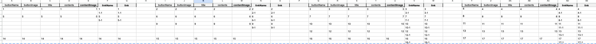

# ExcelToJson Converter

하단의 이미지와 같이 다중 depths(이미지의 경우 4depths)의 tree 관계에 있는 테이블 데이터들을 파싱하여 HashMap 구조의 json으로 변환하는 converter입니다.


기존 작업 시트 기반으로 수동으로 json으로 변환하는 것에 대한 비효율성과 시중에 있는 컨버터들로는 다중 depths의 테이블들 구조 파싱 처리가 되지 않아 만들게 되었습니다.

## 작업 환경 및 스택

Google AppsScript, JavaScript

## 진행 기간

2023.04.04 - 진행중

## 사용 방법

1. 첨부한 구글 시트 이미지와 같이, 구글 시트를 테이블을 기준으로 depths를 나누고, 수평으로 부모-자식 관계를 설정한다.

2. link와 linkname은 복수의 갯수를 설정할 수 있다.
3. AppsScript에 converter 함수를 넣고, sheet 불러오는 코드에 대한 주석을 해제한다.
4. 하단의 headers와 rows 상수값들은 주석처리한다.
5. 함수 실행
6. 구글 드라이브에 json 생성 파일 확인

## 결과

<details><summary>Json Console 결과 보기</summary>
console에서는 Object의 데이터가 가려져서 나오지만, 데이터 직접 처리할 때는 해당 객체 데이터에 접근 가능하다. 
  
```json
{ '0':
   { upperTitle: '',
     buttonName: '1',
     buttonImage: '1',
     title: '1',
     contents: '1',
     contentImage: '1',
     links: [ [Object], [Object], [Object] ],
     selection: [ '1' ] },
  '1':
   { upperTitle: '1',
     buttonName: '2',
     buttonImage: '2',
     title: '2',
     contents: '2',
     contentImage: '2',
     links: [ [Object], [Object] ],
     parent: '0',
     selection: [ '2' ] },
  '2':
   { upperTitle: '2',
     buttonName: '3',
     buttonImage: '3',
     title: '3',
     contents: '3',
     contentImage: '3',
     links: [ [Object], [Object] ],
     parent: '1',
     selection: [ '3' ] },
  '3':
   { upperTitle: '3',
     buttonName: '4',
     buttonImage: '4',
     title: '4',
     contents: '4',
     contentImage: '4',
     links: [ [Object], [Object] ],
     parent: '2',
     selection: [] },
  '4':
   { upperTitle: '',
     buttonName: '5',
     buttonImage: '5',
     title: '5',
     contents: '5',
     contentImage: '5',
     links: [ [Object], [Object] ],
     selection: [ '5', '8' ] },
  '5':
   { upperTitle: '5',
     buttonName: '6',
     buttonImage: '6',
     title: '6',
     contents: '6',
     contentImage: '6',
     links: [ [Object], [Object] ],
     parent: '4',
     selection: [ '6' ] },
  '6':
   { upperTitle: '6',
     buttonName: '7',
     buttonImage: '7',
     title: '7',
     contents: '7',
     contentImage: '7',
     links: [ [Object], [Object] ],
     parent: '5',
     selection: [ '7' ] },
  '7':
   { upperTitle: '7',
     buttonName: '8',
     buttonImage: '8',
     title: '8',
     contents: '8',
     contentImage: '8',
     links: [ [Object], [Object] ],
     parent: '6',
     selection: [] },
  '8':
   { upperTitle: '5',
     buttonName: '9',
     buttonImage: '9',
     title: '9',
     contents: '9',
     contentImage: '9',
     links: [ [Object] ],
     parent: '4',
     selection: [ '9' ] },
  '9':
   { upperTitle: '9',
     buttonName: '10',
     buttonImage: '10',
     title: '10',
     contents: '10',
     contentImage: '10',
     links: [ [Object], [Object], [Object], [Object] ],
     parent: '8',
     selection: [ '10' ] },
  '10':
   { upperTitle: '10',
     buttonName: '11',
     buttonImage: '11',
     title: '11',
     contents: '11',
     contentImage: '11',
     links: [ [Object] ],
     parent: '9',
     selection: [] },
  '11':
   { upperTitle: 5,
     buttonName: '12',
     buttonImage: '12',
     title: '12',
     contents: '12',
     contentImage: '12',
     links: [ [Object], [Object] ],
     selection: [ '12', '14' ] },
  '12':
   { upperTitle: '12',
     buttonName: '13',
     buttonImage: '13',
     title: '13',
     contents: '13',
     contentImage: '13',
     links: [ [Object], [Object] ],
     parent: '11',
     selection: [ '13' ] },
  '13':
   { upperTitle: '13',
     buttonName: '14',
     buttonImage: '14',
     title: '14',
     contents: '14',
     contentImage: '14',
     links: [ [Object], [Object] ],
     parent: '12',
     selection: [] },
  '14':
   { upperTitle: '12',
     buttonName: '15',
     buttonImage: '15',
     title: '15',
     contents: '15',
     contentImage: '15',
     links: [ [Object], [Object] ],
     parent: '11',
     selection: [ '15', '16', '17', '18' ] },
  '15':
   { upperTitle: '15',
     buttonName: '16',
     buttonImage: '16',
     title: '16',
     contents: '16',
     contentImage: '16',
     links: [ [Object], [Object] ],
     parent: '14',
     selection: [] },
  '16':
   { upperTitle: '15',
     buttonName: '17',
     buttonImage: '17',
     title: '17',
     contents: '17',
     contentImage: '17',
     links: [ [Object], [Object] ],
     parent: '14',
     selection: [] },
  '17':
   { upperTitle: '15',
     buttonName: '18',
     buttonImage: '18',
     title: '18',
     contents: '18',
     contentImage: '18',
     links: [ [Object], [Object] ],
     parent: '14',
     selection: [] },
  '18':
   { upperTitle: '15',
     buttonName: '19',
     buttonImage: '19',
     title: '19',
     contents: '19',
     contentImage: '19',
     links: [ [Object], [Object] ],
     parent: '14',
     selection: [] } }
```

</details>

## 코드 구현 단계별 설명

1. `SpreadsheetApp.getActiveSpreadsheet().getSheetByName('sheet명')`으로 sheet 불러오기
2. `sheet.getDataRange().getValues()`로 데이터 추출
3. 시트마다 달라질 변수들 상수화하여 처리

```javascript
const PROPERTY_LENGTH = 8;
```

4. 각 테이블 및 행 단위로 데이터 구분 작업 진행 (빈 열이 테이블을 구분하는 기준)
5. 이때 link와 linkName과 같이 옵션들이 있는 프로퍼티를 마주칠 경우, 해당 행을 부모로 잡고, 아래 행들을 순회하며 옵션값들이 있으면 누적
6. 프로퍼티들을 다 채웠고, 최종 데이터인 것에 한해서(ex. title에 값이 있는 경우) result에 추가
7. link 옵션들 관심사 분리 작업 :
   - link와 linkName들을 하나의 dataset으로 만들어 links라는 property에 array of object로 추가 및 각 link object에 unique id 부여 (link 구분하기 위함)
8. uniqueid를 인덱스로 가지는 hashmap 구조로 변환
9. 이중 반복문으로 자신의 title을 upperTitle로 가지고 있는 자식 데이터의 uniqueid를 selection에 추가하여 부모 자식 관계 설정.
   - 꼭 upperTitle이 아니더라도 uinque한 값을 기준으로 연결 지으면 됨
10. **[output size 초과에 대한 이슈]** 로그로 찍혀 나온 결과값들은 크기가 크면 잘려서 나오기 때문에, 이에 대응하여 json 파일을 만들어 내어 Google Drive로 저장해줌

### upperTitle 프로퍼티 설정 이유

converter가 부모와 자식관계를 파악하기 위해 upperTitle 등과 같은 unique 값이 있어야한다.

- 이렇게 프로퍼티를 추가한 이유는 엑셀 내 공백의 예외 사항이 link의 옵션일 경우, 앞의 상위 뎁스에 대한 공백일 경우, 하위 뎁스에 대한 공백일 경우, 예상치 못하여 저장된 공백일 경우 등, 다양한 예외 케이스가 발생하기 때문임

## 남은 작업

- [x] link의 갯수가 유효할 때까지 계속 merge되도록 리팩토링 (기존에는 2개까지만 merge가 됐었음)
- [x] depth 간 부모-자식 관계 처리를 위한 selections 프로퍼티 추가 및 자식 id 처리
